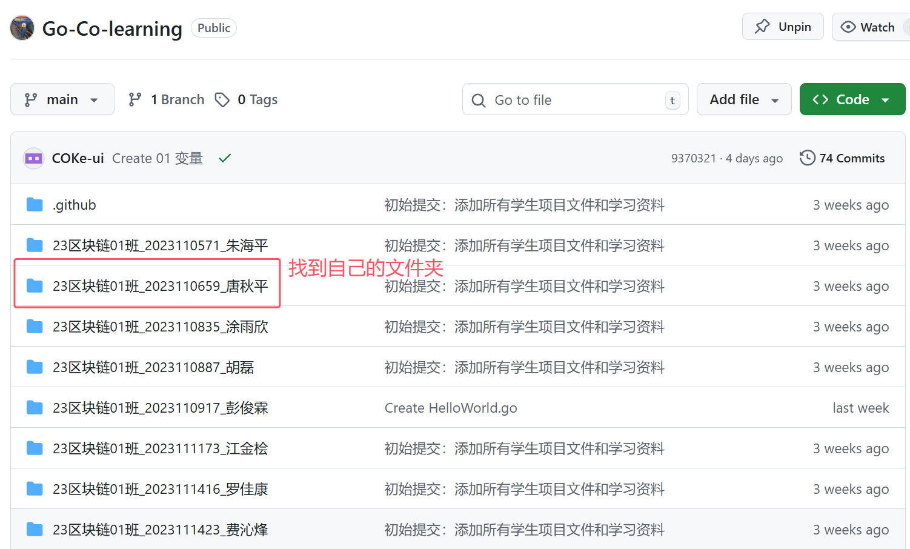
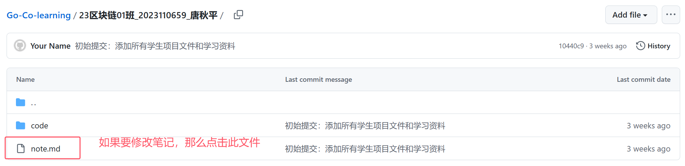
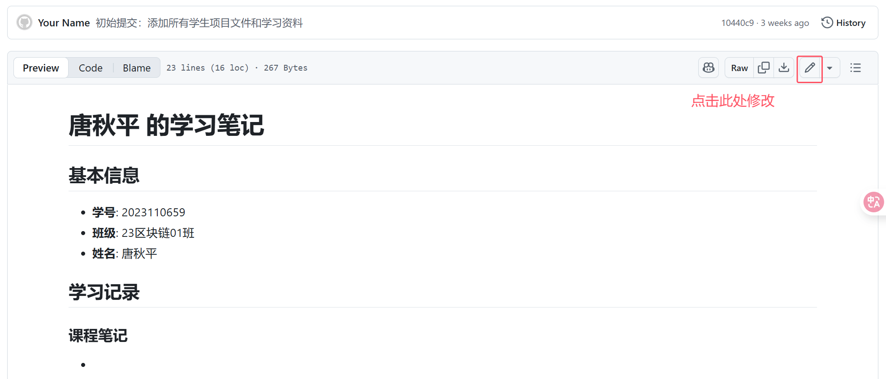
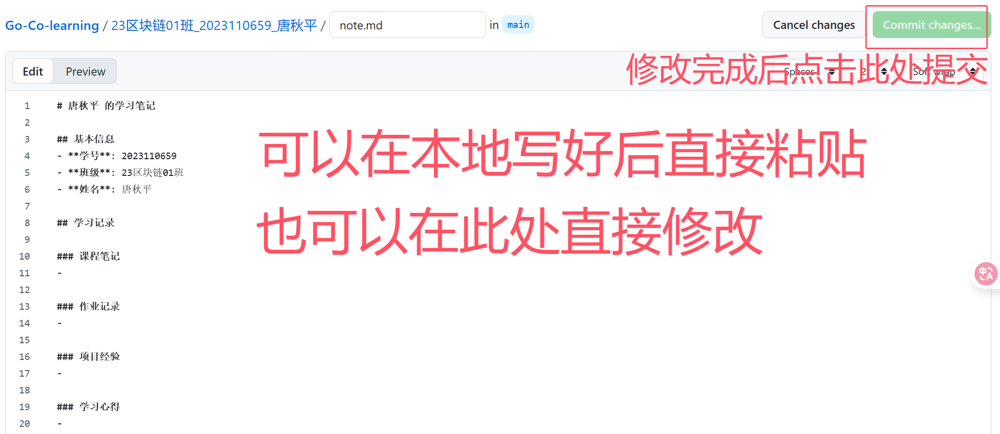
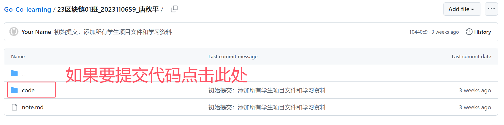
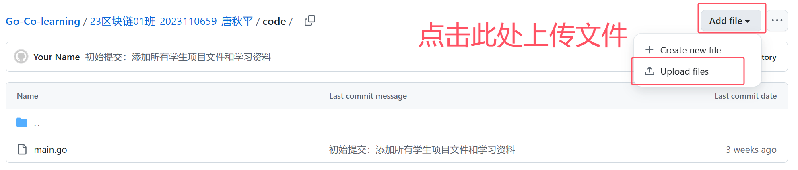
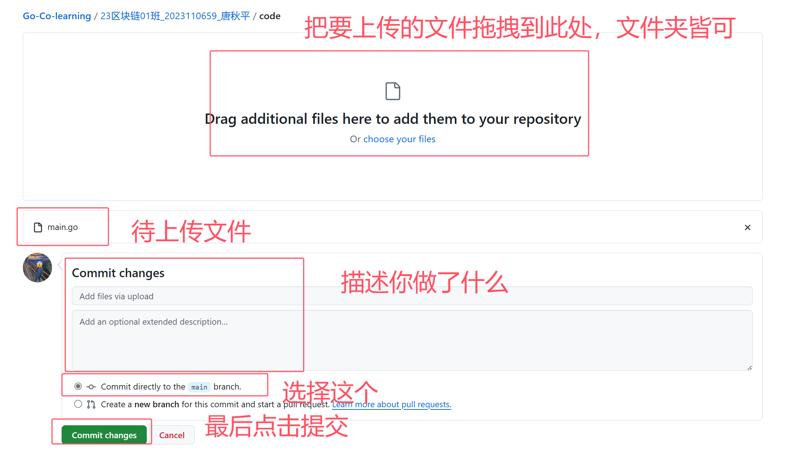

# 区块链专业协作学习仓库

## 📖 学生操作手册

### 🚀 快速开始指南

欢迎使用区块链专业协作学习仓库！本手册将指导您完成从修改文件到提交代码的完整流程。

#### 如果没有下载仓库代码
先安装git[教程](https://zhuanlan.zhihu.com/p/443527549)

下载仓库
```bash
git clone https://github.com/zhouCode/Go-Co-learning.git
cd Go-Co-learning
```

# 📝 每次写代码前需要拉取最新仓库代码

**拉取最新代码**

```bash
# 【重要】开始工作前先拉取最新的远程代码
git pull origin main
```

#### 🔄 完整操作流程示例

**场景：您刚完成了一次学习，需要更新笔记和代码**
# 第一步 找到自己的文件夹

# 第二步 找到自己的笔记

# 第三步 增加自己的笔记

# 第四步 提交笔记

# 第五步 找到代码文件夹

# 第六步 上传代码文件

# 第七步 点击提交代码


#### ⚠️ 重要注意事项

**文件操作注意事项：**
- ✅ **每次开始工作前必须先拉取最新代码** (`git pull origin main`)
- ✅ 只修改您自己的文件夹内容
- ❌ 不要修改其他同学的文件夹
- ❌ 不要修改根目录的配置文件


### Git自动拉取配置

为了减少合并冲突，建议配置Git自动拉取策略（仅对当前仓库生效）：

```bash
# 启用变基策略（推荐）
git config pull.rebase true

# 自动设置合并分支
git config branch.autoSetupMerge always

# 仅允许快进式合并
git config pull.ff only
```

**配置效果：**
- 🎯 **精确控制**：只影响当前Go学习项目
- 🔒 **不影响其他项目**：其他仓库保持原有设置
- 📈 **更好的代码历史**：保持线性提交历史
- ⚡ **自动化拉取**：减少合并冲突

**验证配置：**
```bash
# 查看当前仓库的Git配置
git config --list --local | Select-String "pull|branch"
```

### 操作建议

**最佳实践：**
- ✅ 每次工作前先执行 `git pull origin main`
- ✅ 频繁提交，避免积累太多变更
- ✅ 使用有意义的提交信息
- ✅ 定期备份重要代码

**避免的操作：**
- ❌ 不要强制推送（`git push -f`）
- ❌ 不要修改其他同学的文件
- ❌ 不要在多个设备上同时编辑同一文件
- ❌ 不要忽略Git的警告信息

---

## 📚 项目简介

这是一个专为区块链专业学生设计的协作学习仓库，每个学生都有自己的专属文件夹，用于存放学习笔记、代码练习和项目作业。

## 🏗️ 仓库结构

```
Co-learning-repo/
├── 23区块链01班_学号_姓名/
│   ├── note.md          # 个人学习笔记
│   └── code/            # 代码文件夹
│       └── main.go      # Go语言示例程序
├── 23区块链02班_学号_姓名/
│   ├── note.md
│   └── code/
│       └── main.go
├── teacher/             # 教师资源文件夹
├── README.md           # 项目说明文档
└── .github/            # GitHub配置文件
```

## 👥 参与学生

### 23区块链01班 (25人)
- 2023110571_朱海平
- 2023110659_唐秋平
- 2023110835_涂雨欣
- 2023110887_胡磊
- 2023110917_彭俊霖
- 2023111173_江金桧
- 2023111416_罗佳康
- 2023111423_费沁烽
- 2023111580_杨程喆
- 2023111810_唐梦琴
- 2023111833_刘昱彤
- 2023112319_程蒙蒙
- 2023112567_向东萍
- 2023112758_任建飞
- 2023112796_高新博
- 2023112957_李卓豪
- 2023113013_张紫浩
- 2023113122_胡文杰
- 2023113248_吴杭君
- 2023113505_罗聿航
- 2023114550_温思涵
- 2023114594_董升
- 2023114744_周成松
- 2023115001_张跃
- 2211210127_赵博雅

### 23区块链02班 (27人)
- 2023110554_唐浚豪
- 2023110726_王鹏
- 2023111182_杜俊哲
- 2023111222_王明明
- 2023111492_曾月
- 2023111594_谭晓静
- 2023111871_张一
- 2023111967_何诗妍
- 2023112049_高卫东
- 2023112222_杨玙宁
- 2023112376_李德杰
- 2023112407_文林
- 2023112601_刘建豪
- 2023112984_钟凯良
- 2023113103_何霖
- 2023113249_王鹏
- 2023113333_黄晓玉
- 2023113345_肖红伟
- 2023113499_刘秋萍
- 2023113528_韩熙文
- 2023113595_靳京华
- 2023113815_胡轩瑞
- 2023113943_王传浩
- 2023114031_王浩宇
- 2023114180_王道菊
- 2023115219_殷毓
- 2023115246_梁勇


#### 权限系统维护

**教师维护任务：**
- 定期更新学生映射表
- 监控权限检查日志
- 处理权限相关的问题反馈
- 根据需要调整权限规则

**学生注意事项：**
- 确保GitHub用户名与映射表一致
- 只修改自己的文件夹内容
- 遇到权限问题及时联系教师
- 不要尝试绕过权限检查系统

### 学生权限
- ✅ **可以做的事情：**
  - 修改自己文件夹内的所有文件（基于映射表验证）
  - 在自己的 `note.md` 中记录学习笔记
  - 在自己的 `code/` 文件夹中编写和修改代码

- ❌ **不能做的事情：**
  - 修改其他同学的文件夹
  - 修改根目录的配置文件（README.md、.gitignore等）

### 教师权限
- 拥有仓库的完全管理权限
- 可以审核和合并所有Pull Request
- 可以修改仓库配置和权限设置
- 可以更新学生映射表


## 📝 学习笔记模板

每个学生的 `note.md` 文件包含以下部分：

```markdown
# 姓名 的学习笔记

## 基本信息
- **学号**: 你的学号
- **班级**: 你的班级
- **姓名**: 你的姓名

## 学习记录

### 课程笔记
- 记录课堂重点内容

### 作业记录
- 记录作业完成情况

### 项目经验
- 记录项目开发经验

### 学习心得
- 记录学习感悟和思考
```

## 💻 Go语言学习

每个学生的 `code/main.go` 文件是一个个性化的Go语言入门程序，包含：
- 基本的Hello World输出
- 个人信息显示
- 变量声明和使用
- 函数定义和调用

### 运行Go程序
```bash
# 进入code文件夹
cd 你的文件夹名/code/

# 运行Go程序
go run main.go
```

## 📞 联系方式

如有问题，请联系：
- **教师邮箱**: [请教师填写实际邮箱地址]
- **课程群**: [请填写实际的课程群信息]
- **GitHub Issues**: 可以在本仓库创建Issue反馈问题


## 📄 许可证

本项目仅用于教学目的，所有内容归相应作者所有。
